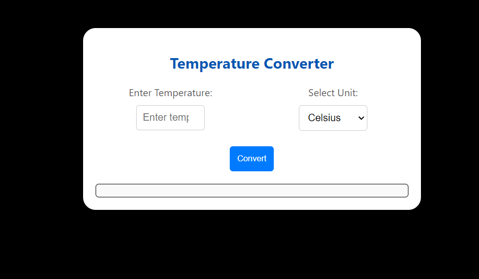

# Temperature Converter

This is a simple web-based temperature conversion program. It allows users to enter a temperature value in Celsius, Fahrenheit, or Kelvin, and converts it to the other two units.

## How to Use

1. Open the `Temperature.html` file in your web browser.
2. Enter the temperature value in the input field.
3. Select the unit of the entered temperature from the dropdown menu.
4. Click the "Convert" button.
5. The converted temperatures will be displayed below the input fields.

## Features

- Supports conversion between Celsius, Fahrenheit, and Kelvin.
- Simple and intuitive user interface.
- Validations to ensure that only numeric values are entered for temperature.

## Technologies Used

- HTML
- CSS (Styling)
- JavaScript (Functionality)

## Preview

## License

This project is licensed under the MIT License - see the [LICENSE](LICENSE) file for details.

